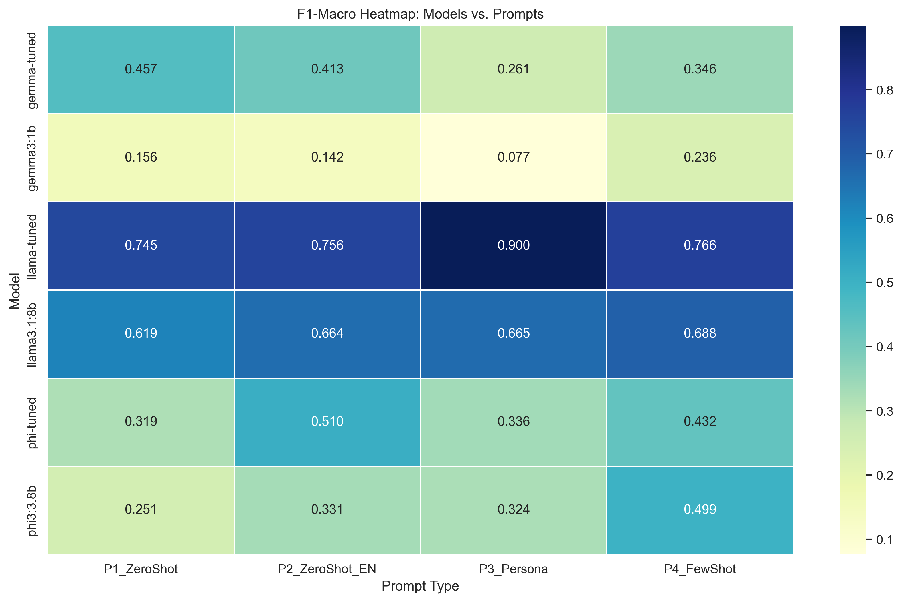
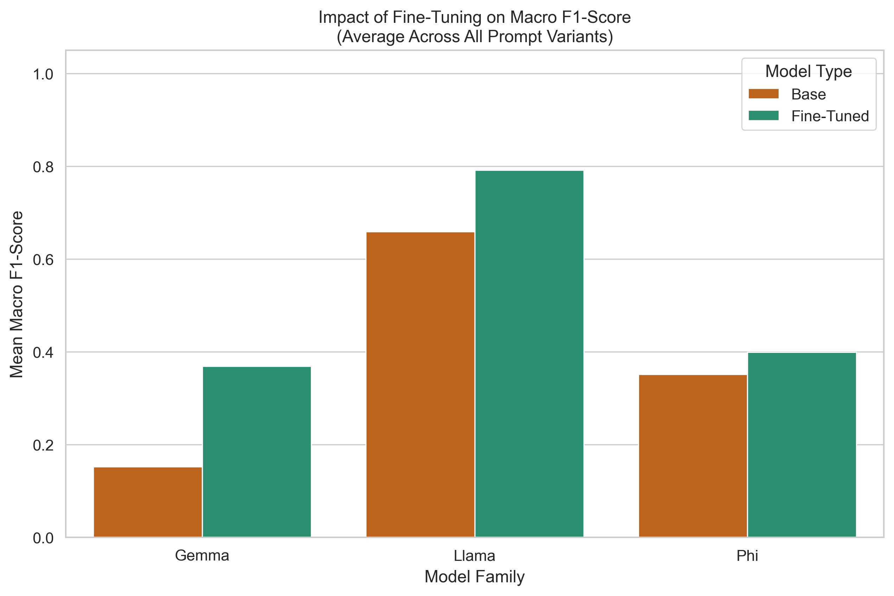
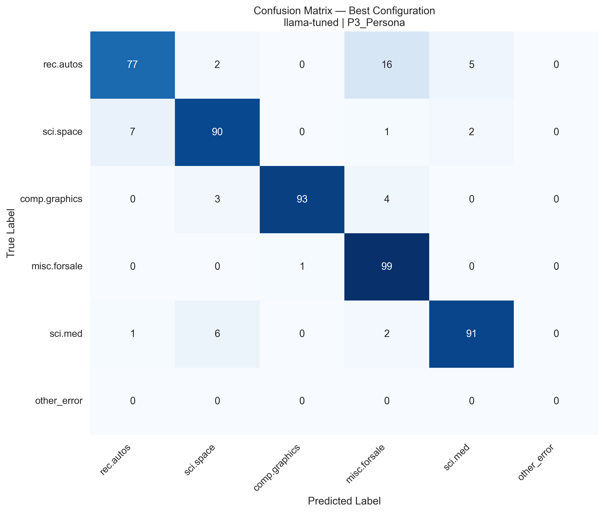
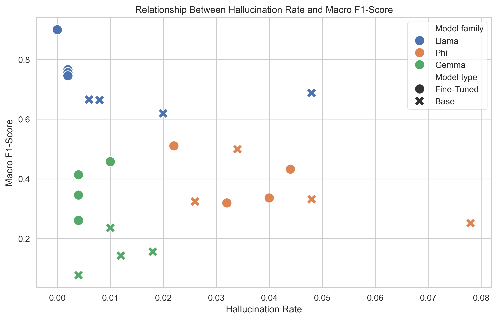

# Local LLMs for Email Triage: Benchmark and Test Bench

A systematic comparison of **small, locally hosted LLMs** (run through [Ollama](https://ollama.com)) on email classification, covering how model choice, prompt strategy and fine-tuning affect accuracy and hallucinations. A full-stack email app is included as a test bench that runs the best configurations on real mailboxes.

Built for my master's thesis (Computer Science, Kielce University of Technology). All inference is local, with no external AI API, so email content never leaves the machine.

## What is compared

| Dimension | Variants |
|---|---|
| Models | `gemma3:1b`, `phi3:3.8b`, `llama3.1:8b` and fine-tuned versions of each (`gemma-tuned`, `phi-tuned`, `llama-tuned`) |
| Prompts | four variants: zero-shot (Polish), zero-shot (English), persona, few-shot (5 examples) |
| Fine-tuning | QLoRA (4-bit) on the training split: LoRA rank 16, 1 epoch, learning rate 2e-4, exported to GGUF (Q4_K_M) and served through Ollama |
| Data | 20 Newsgroups subset, 5 classes (`rec.autos`, `sci.space`, `comp.graphics`, `misc.forsale`, `sci.med`), up to 500 samples per class, stratified 50/50 split |
| Benchmark test set | 500 messages (100 per class), taken from the held-out test split |
| Metrics | accuracy, macro precision / recall / F1, weighted F1, **hallucination rate** (answers containing none of the allowed labels) |

## Key results

Evaluated on 500 test messages (100 per class).

- **Best configuration: fine-tuned Llama 3.1 8B with the persona prompt**, macro F1 ≈ 0.90 and accuracy 90% (450 / 500), with no answers outside the label set.
- **Fine-tuning improved all three model families on average, but by very different amounts** (mean macro F1 across prompts, base → tuned): Gemma 3 1B ≈ 0.15 → 0.37, Llama 3.1 8B ≈ 0.66 → 0.79, Phi-3 Mini ≈ 0.35 → 0.40. The gains for Gemma and Llama are large. The Phi-3 gain (+0.05) is small and, with a 500-message test set and no significance test, may be within noise. Fine-tuning lifted the 1B Gemma to roughly the level of the untuned 3.8B Phi-3.
- **The best prompt depends on the model, and changes after fine-tuning**: for Llama the best prompt is few-shot (0.69) for the base model but persona (0.90) for the tuned one; for Phi-3 it is few-shot (0.50) for the base model and the English zero-shot prompt (0.51) for the tuned one. Prompt choice changed macro F1 by up to about 0.25 within a single model (base Phi-3: 0.25 to 0.50).
- **Low scores were mostly misclassifications, not invalid answers**: the hallucination rate stayed below 8% everywhere (highest: base Phi-3 with the Polish zero-shot prompt, ≈ 7.8%) (see the note on answer parsing in the caveats). The weakest setup, Gemma 3 1B with the persona prompt, collapsed to predicting almost only `sci.med` (accuracy ≈ 21%, close to the 20% chance level).

**Macro F1 for every model and prompt.** Fine-tuned Llama 3.1 8B with the persona prompt is the strongest cell (0.900). Base Gemma 3 1B is the weakest (0.077 to 0.236).



**Effect of fine-tuning.** Mean macro F1 across prompts, base vs. fine-tuned, per model family.



**Confusion matrix of the best configuration** (fine-tuned Llama 3.1 8B, persona prompt). The most frequent error is `rec.autos` predicted as `misc.forsale` (16 of 100), plausibly because car posts often contain sale offers.



**Macro F1 vs. hallucination rate** (each point is one model × prompt configuration). The hallucination rate stays low everywhere, so weak results come from wrong classes rather than invalid answers.



**Caveats:**
- Training and test data come from the same dataset, so the fine-tuning gains are in-domain and would likely be smaller on real-world email. 20 Newsgroups posts are not typical email.
- The test set is small (500 messages) and no statistical significance tests were run, so small differences between configurations should not be over-interpreted.
- Answer parsing is lenient: an answer is mapped to the first allowed label found anywhere in the text, checked in a fixed label order (not by position in the text). An answer in the wrong format that still mentions a label therefore counts as a normal (possibly wrong) prediction, not as a hallucination. The hallucination rate is thus a lower bound on format errors.
- "Hallucination" here means only "no allowed label in the answer". It is a narrower notion than hallucination in the general LLM literature.

## Experiment pipeline

Analysis scripts are in `backend/analyze/`:

| Step | Script | What it does |
|---|---|---|
| 1. Prepare data | `clean_dataset.py` | loads 20 Newsgroups via scikit-learn, strips headers, footers, quotes, URLs and mentions, balances classes, saves a labeled CSV and the class distribution |
| 2. Split | `split_dataset.py` | stratified train/test split |
| 3. Fine-tune | fine-tuning notebook (Google Colab, Unsloth + TRL) | QLoRA fine-tuning of Phi-3-mini, Llama 3.1 8B and Gemma 3 1B on the training split only, then GGUF export for Ollama |
| 4. Evaluate | evaluation run through Ollama | every test message is classified by every model × prompt combination; results are saved to `grid_search_results.csv` with the columns `email_id`, `true_label`, `model`, `prompt_type`, `predicted_label` |
| 5. Analyze | `grid_analyze.py` | maps model answers to labels (no allowed label in the answer counts as a hallucination), computes all metrics, writes 9 result tables and up to 15 charts to an output folder (`wyniki_magisterka/` by default) |

`grid_analyze.py` produces: class distribution, main metrics per configuration, per-class metrics, base vs fine-tuned averages and deltas, final ranking, best and worst configuration per class, most frequent confusions, F1 / accuracy / precision / recall heatmaps, hallucination vs F1 scatter, stability boxplots and confusion matrices.

## Analyzing the results

`grid_analyze.py` takes the raw model answers (`grid_search_results.csv` with the columns `email_id`, `true_label`, `model`, `prompt_type`, `predicted_label`) and produces all tables and charts shown above.

```bash
cd backend/analyze
pip install pandas scikit-learn matplotlib seaborn

python clean_dataset.py     # prepare data
python split_dataset.py     # train/test split
python grid_analyze.py      # tables and charts -> wyniki_magisterka/
```

The fine-tuned models were trained in a Google Colab notebook (included in this repository) and then imported into Ollama. The resulting GGUF files are not published.

## Test bench application

A web app that applies the same classifier in a realistic workflow: it fetches mail over IMAP and, for every message, runs a background pipeline (classify and prioritize → summarize → draft a reply). It also supports conversation threading with AI thread summaries, replying through SMTP and per-user accounts with JWT.

| Layer | Technologies |
|---|---|
| Frontend | React 19, TypeScript, Vite, Tailwind CSS |
| Backend | Python 3.12, Django 6, Django REST Framework, SimpleJWT |
| Jobs / DB / AI | Django-Q2, PostgreSQL 16 (Docker), Ollama (default `gemma3:1b`) |

```
React (:5173) ──/api──▶ Django REST (:8000) ──▶ PostgreSQL
                              ├─ IMAP / SMTP
                              └─ Django-Q worker ──▶ Ollama (:11434)
```

The pipeline is a fixed chain of three model calls, not an autonomous agent. The app is a prototype for local use.

## Run the app locally

Requires Python 3.12+, Node.js, Docker and Ollama.

```bash
docker compose up -d                 # PostgreSQL
ollama pull gemma3:1b                # model

cd backend
python -m venv .venv && source .venv/bin/activate   # Windows: .venv\Scripts\activate
pip install -r requirements.txt
python manage.py migrate
python manage.py runserver           # terminal 1: API on :8000
python manage.py qcluster            # terminal 2: background AI worker

cd ../frontend
npm install && npm run dev           # UI on http://localhost:5173
```

Backend unit tests: `python manage.py test`.